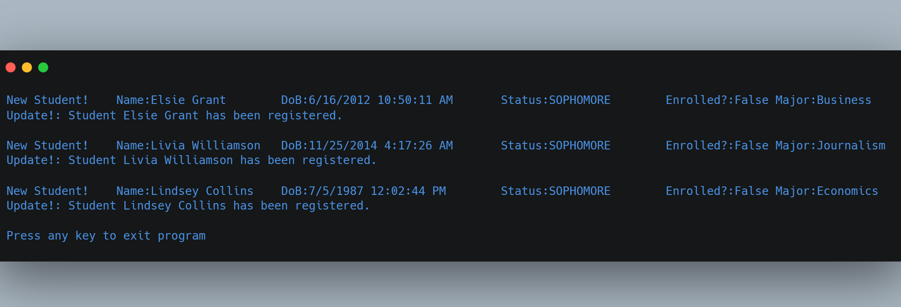

# Publisher-Subscriber Pattern

(FSC-BCS-426-Lab8)

## Output

## Assignment Context

This project was one of the later assignments for my C# Programming class.

The goal of this assignment was to further explore C# by implementing the Publisher-Subscriber software architecture pattern.

This was a solo assignment made with C#, and Visual Studio 2022.

## Features

This program implements the Publisher-Subscriber software architecture pattern, also known as the Pub/Sub pattern. 
It creates an instance of a Registrar object, which acts as the subscriber/consumer, and multiple instances of a Student object, which acts as the publisher/producer. 
The Student object publishes new student information to the Registrar object through an event handler.

## How It Works

The program uses the Publisher-Subscriber software architecture pattern to implement the communication between the Student and Registrar objects. 
The Student object is the publisher, which raises the `NewStudentInfo` event whenever a new student is created. 
The Registrar object is the subscriber, which listens for the `NewStudentInfo` event and handles it by calling the `NewStudentArrived` method. 
The `NewStudentArrived` method updates the registered field for the student to true and outputs a message to the console stating that the student has been registered.

The `StudentInfoEventArgs` class is used to pass student information between the Student and Registrar objects. 
This class contains properties for the student's name, date of birth, major, status, and registration status. 
The `NewStudent` method in the Student object takes in the necessary student information and raises the `NewStudentInfo` event with a new instance of the `StudentInfoEventArgs` class.

The `Main` method in the `Program` class creates multiple instances of the Student object, each of which registers a new student with the Registrar object through the `NewStudentArrived` method. 
Each Student object instance is also given a random name, date of birth, major, status, and registration status. 
The `Thread.Sleep` method is used to delay the creation of each new student for a random amount of time between 100 and 3000 milliseconds.

Finally, when the program is complete, the console outputs a message prompting the user to exit the program.
